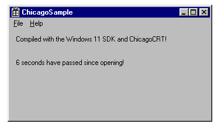
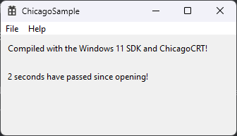

# ChicagoCRT Sample

This is a sample project for [ChicagoCRT](https://github.com/AnalogFeelings/ChicagoCRT), using the raw Win32 API on C17 with MSVC.  
Done very haphazardly, the labels even use the Windows 3.x font.

## :framed_picture: Screenshots

Windows 95 (on 86box)  

Windows 11 (my PC)  

## :toolbox: Build instructions

Requires Visual Studio 2022, with the C++ workload installed and the Windows SDK.  
Building can be done as with any standard C++ project, and the output will be found on the `Debug` or `Release` folder.

## :sparkles: Bonus

This repository includes a C# script to patch the executable automatically!  
You can find it in the Scripts subfolder at the root of the repository.

# :balance_scale: License

This software is licensed under the terms of the MIT license.  
You can read the terms [here](LICENSE).
